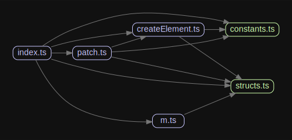

# 源码分析

## 文件结构

``` bash
/Users/liufang/openSource/FunnyLiu/million
├── LICENSE
├── README.md
├── benchmarks
|  ├── README.md
|  ├── conditional-render.js
|  ├── index.html
|  ├── list-render.js
|  └── text-interop.js
├── commitlint.config.js
├── jest.config.js
├── package.json
├── rollup.config.js
├── scripts
|  ├── build.sh
|  ├── check.sh
|  ├── dev.sh
|  ├── helpers.sh
|  └── release.sh
├── src
|  ├── __test__
|  |  ├── createElement.spec.ts
|  |  ├── m.spec.ts
|  |  └── patch.spec.ts
|  ├── constants.ts
|  ├── createElement.ts
|  ├── index.ts
|  ├── m.ts
|  ├── patch.ts
|  └── structs.ts
├── tsconfig.json
├── vite.config.js
└── yarn.lock

directory: 4 file: 28

ignored

```

## 外部模块依赖


## 内部模块依赖


  
## 知识点


### 基本工作流程

提供3个方法m、createElement和patch。

m用来创建虚拟dom，createElement用来将虚拟dom变为现实dom，patch用来比较和diff老的和新的两个虚拟dom并返回改变后的虚拟dom。

从下面一个例子可以看出3个函数分别在做什么？

``` js
import { m, createElement, patch } from 'https://unpkg.com/million?module';

let clicks = 0;
const app = createElement(
  m(
    'button',
    {
      id: 'app',
      onclick: () => {
        patch(app, m('button', { id: 'app' }, [String(++clicks)]));
      },
    },
    [String(clicks)],
  ),
);
document.body.appendChild(app);
```

### 创建虚拟dom

m函数位于[笔记内容](https://github.com/FunnyLiu/million/blob/readsource/src/m.ts#L53)

三个参数，标签、属性对象、子dom


主要实现如下

``` js
export const m = (tag: string, props?: VProps, children?: VNode[], flag?: VFlags): VElement => {
  let key;
  if (props?.key) {
    key = <string | undefined>props.key;
    delete props.key;
  }
  return {
    tag,
    props,
    children,
    key,
    flag,
  };
};
```

就是返回了一个对象而已

### 将虚拟dom转为真实dom

createElement实现[笔记内容](https://github.com/FunnyLiu/million/blob/readsource/src/createElement.ts#L9)

创建dom、属性、递归子dom

``` js
export const createElement = (vnode: VNode, attachField = true): HTMLElement | Text => {
  if (typeof vnode === 'string') return document.createTextNode(vnode);
  //创建dom
  const el = document.createElement(vnode.tag);
  //赋予dom属性
  if (vnode.props) {
    for (const name of Object.keys(vnode.props)) {
      el[name] = vnode.props[name];
    }
  }
  //如果有子节点则递归创建子dom
  if (vnode.children) {
    for (let i = 0; i < vnode.children.length; i++) {
      el.appendChild(createElement(vnode.children[i]));
    }
  }

  if (attachField) el[OLD_VNODE_FIELD] = vnode;

  return el;
};

```


### diff新老虚拟dom

patch实现在此：[笔记内容](https://github.com/FunnyLiu/million/blob/readsource/src/patch.ts#L74)

实现流程如下：

判断key不一致才diff，如果tag不同则直接替换。

如果rag相同，就挨个排查prop。

对于children则递归再patch来diff

``` js
export const patch = (
  el: HTMLElement | Text,
  newVNode: VNode,
  prevVNode?: VNode,
): HTMLElement | Text => {
  //没有新dom则直接移除老dom
  if (!newVNode) {
    // 删除当前dom本身
    // [Element.remove() - Web APIs | MDN](https://developer.mozilla.org/en-US/docs/Web/API/Element/remove)
    el.remove();
    return el;
  }

  const oldVNode: VNode | undefined = prevVNode ?? el[OLD_VNODE_FIELD];
  const hasString = typeof oldVNode === 'string' || typeof newVNode === 'string';
  //如果是字符串类型，直接替换
  if (hasString && oldVNode !== newVNode) return replaceElementWithVNode(el, newVNode);
  if (!hasString) {
    if (
      (!(<VElement>oldVNode)?.key && !(<VElement>newVNode)?.key) ||
      (<VElement>oldVNode)?.key !== (<VElement>newVNode)?.key
    ) {
      //都有key且key不同才进行diff

      /* istanbul ignore if */
      if (
        (<VElement>oldVNode)?.tag !== (<VElement>newVNode)?.tag &&
        !(<VElement>newVNode).children &&
        !(<VElement>newVNode).props
      ) {
        //如果标签不同，直接全部替换
        // newVNode has no props/children is replaced because it is generally
        // faster to create a empty HTMLElement rather than iteratively/recursively
        // remove props/children
        return replaceElementWithVNode(el, newVNode);
      }
      //如果标签相同，则替换属性
      if (oldVNode && !(el instanceof Text)) {
        patchProps(el, (<VElement>oldVNode).props || {}, (<VElement>newVNode).props || {});

        /* istanbul ignore next */
        switch (<VFlags>(<VElement>newVNode).flag) {
          case VFlags.NO_CHILDREN:
            el.textContent = '';
            break;
          case VFlags.ONLY_TEXT_CHILDREN:
            el.textContent = <string>(<VElement>newVNode).children!.join('');
            break;
          default:
            //再替换子dom
            //本质还是递归patch
            patchChildren(el, (<VElement>oldVNode).children, (<VElement>newVNode).children!);
            break;
        }
      }
    }
  }

  if (!prevVNode) el[OLD_VNODE_FIELD] = newVNode;

  return el;
};
```


# 

### <1kb virtual DOM - it's fast!

Current Virtual DOM implementations are inadequate—Ranging from overcomplicated to abandoned, most are unusable without sacrificing raw performance and size. Million aims to fix this, providing a library-agnostic Virtual DOM to serve as the core for Javascript libraries.

[](https://img.shields.io/github/workflow/status/millionjs/million)
 [](https://www.npmjs.com/package/million) 

[**→ Check out the Million documentation**](https://million.js.org)

## Installing Million

Million doesn't require build tools by default, but it is highly recommended you use NPM to install.

```sh
npm install million
```

## Hello World Example

Below is an extremely simple implementation of a Hello World page using Million.

```js
import { m, createElement, patch } from 'million';

// Initialize app
const app = createElement(m('div', { id: 'app' }, ['Hello World']));
document.body.appendChild(app);
// Patch content
patch(app, m('div', { id: 'app' }, ['Goodbye World']));
```

[**→ Check out more examples**](https://million.js.org)

## Resources & Contributing Back

Looking for the docs? Check the [documentation](https://million.js.org) out.

Have a question about Million? Post it on the [GitHub Discussions](https://github.com/millionjs/million/discussions) and ask the community for help.

Find a bug? Head over to our [issue tracker](https://github.com/millionjs/million/issues) and we'll do our best to help. We love pull requests, too!

We expect all Million contributors to abide by the terms of our [Code of Conduct](https://github.com/millionjs/million/blob/main/.github/CODE_OF_CONDUCT.md).

[**→ Start contributing on GitHub**](https://github.com/millionjs/million/blob/main/.github/CONTRIBUTING.md)

## Acknowledgments

Million takes heavy inspiration from [React](https://github.com/facebook/react), and believes in the core philosophies and values behind [Lucia](https://github.com/aidenybai/lucia) and [Inferno](https://github.com/infernojs/inferno). Feel free to check them out if you interested in an alternative library to use.

_Why is it called "Million"? The name originated with the goal of being able to handle [1M+ ops/sec for benchmarks](https://github.com/millionjs/million/tree/main/benchmarks#readme)_

## License

Million is [MIT-licensed](LICENSE) open-source software by [Aiden Bai](https://github.com/aidenybai), [William Lane](https://github.com/willdoescode), [et al.](https://github.com/millionjs/million/graphs/contributors)
